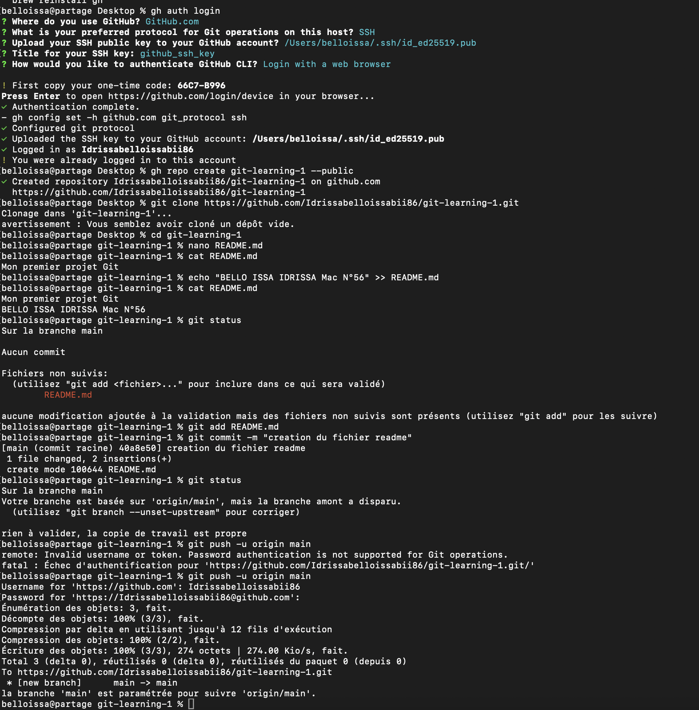
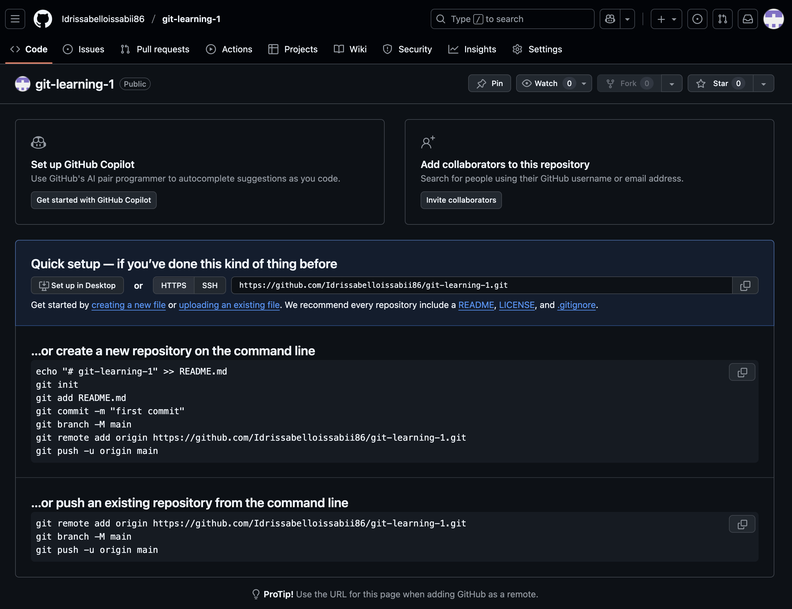
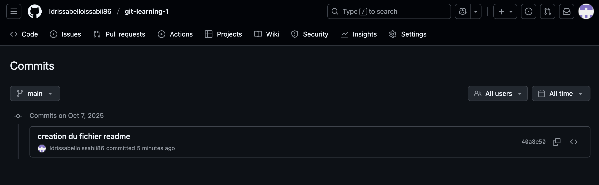
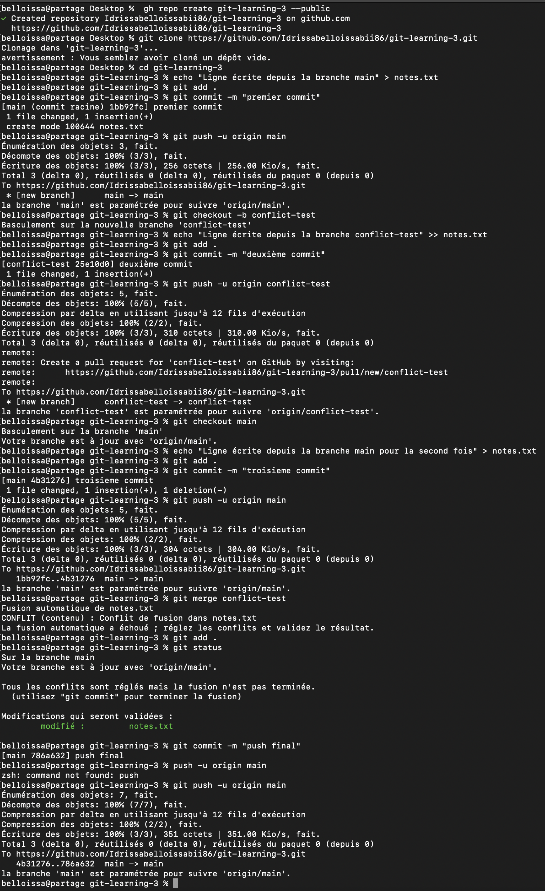
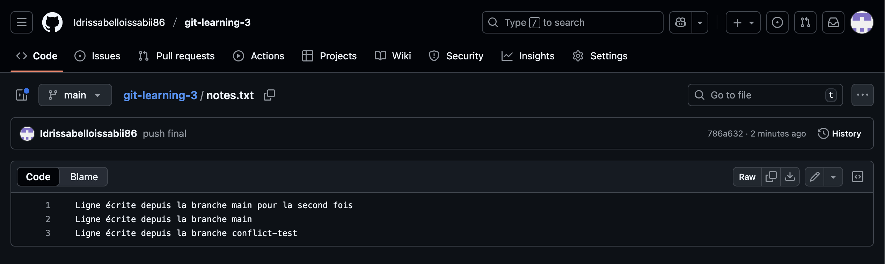
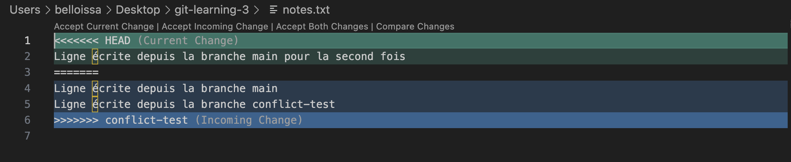

# Projet Git & GitHub

Ce fichier contient la description de mon expérience pour chaque exercice ainsi que la procédure suivi et la capture d'écran des commandes et vérifications effectuée

## Excercice n°1

### 🧾 Description de l'expérience

Dans ce premier exercice consacré sur la création, les modifications, enregistrements et le suivi des repos github, j'ai appris à manipuler plusieurs commandes telles que git push, clone, add, commit, log, etc... J'ai également pris connaissance de plusieurs outils comme "gh" qui nous permet entre autre de nous connecter via HTTPS ou SSH à notre compte github pour pouvoir créer un repo depuis notre terminal vers notre compte github. J'ai également compris ce qu'est git et gihub et les différences qui les accompagnes.

### 💻 Les commandes utilisées

- brew install gh
- gh auth login
- gh repo create git-learning-1 --public
- git clone https://github.com/Idrissabelloissabii86/git-learning-1.git
- cd git-learning-1
- nano README.md
- git add README.md
- git commit -m "Insertion des deux lignes de l'exo (description, nom et numéro de mac)"
- git status
- git push -u origin main
- git log

### Capture d'écran du terminal

### Capture d'écran github

=================================================================================

## Excercice n°2

### 🧾 Description de l'expérience

Cet exercice m'a permis de mieux comprendre les notions de branches entre autres comment on créer une nouvelle branche, apporter des modification pour ensuite les repercuter sur la branche peincipale à laquelle le projet initial est lié.

De façon plus précise et technique j'ai compris : clone, push, pull et merge du git & github.

### 💻 Les commandes utilisées

- gh repo create git-learning-2 --public
- git clone https://github.com/Idrissabelloissabii86/git-learning-3.git
- cd git-learning-2
- touch test.txt
- git add test.txt
- git commit -m "Commit vers main"
- git branch
- git push -u origin main
- git checkout -b myself
- nano about.txt
- git add about.txt
- git commit -m "commit du fichier about sur la branche myself"
- git push -u origin myself
- gh pr create --base main --head myself --title "Pull request" --body "Pull request de la branche myself vers main"
- gh pr merge https://github.com/Idrissabelloissabii86/git-learning-2/pull/1

### Capture d'écran du terminal

### Capture d'écran github

=================================================================================

## Excercice n°3

### 🧾 Description de l'expérience

Dans ce dernier exercice j'ai appris la gestion des conflits du merging qui peuvent survenir quand un fichiers est modifié a travers plusieurs branches et que l'ordre de la procédure n'est pas respecté. cela m'a permis de mesuré l'importance de faire les choses dans le bon ordre car l'erreur rencontré lors de la résolutions de l'exercice, réside dans le fait que le fichier créer avec la branche main au début a ensuite été modifié dans autre branche (conflict-test) sans pour autant rabattre la modification faite sur la branche principale (main). C'est pourquoi lors de la troisième modification cette fois-ci avec la branche main on rencontre une erreur quand on essaie de faire un merge.

### 💻 Les commandes utilisées

- gh repo create git-learning-3 --public
- git clone https://github.com/Idrissabelloissabii86/git-learning-3.git
- cd git-learning-3
- echo "Ligne écrite depuis la branche main" > notes.txt
- git add .
- git commit -m "premier commit"
- git push -u origin main
- git checkout -b conflict-test
- echo "Ligne écrite depuis la branche conflict-test" >> notes.txt
- git add .
- git commit -m "deuxième commit"
- git push -u origin conflict-test
- git checkout main
- echo "Ligne écrite depuis la branche main pour la second fois" > notes.txt
- git add .
- git commit -m "troisieme commit"
- git push -u origin main
- git merge conflict-test
- git add .
- git status
- git commit -m "push final"
- git push -u origin main

### Capture d'écran du terminal

### Capture d'écran github

### Capture de l'éditeur de texte

